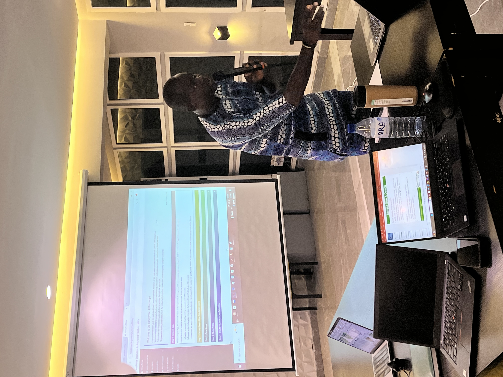

---
output:
  bookdown::html_book:
    number_sections: false
---

<!-- ## SAE4Health Featured in WHO Workshops Across Africa -->
#  Capacity Building with SAE4Health: Nigeria Workshops

In collaboration with <a href="https://faculty.washington.edu/jonno/" target="_blank"> Professor Jon Wakefield</a> and his team, based at the University of Washington, **the Government of Nigeria**, with support from **UNICEF** and **GAVI**, has spearheaded the development of DHS and MICS small area estimation (SAE) methodology for Nigeria.

The Nigerian government has recently passed a law to directly send funding to Local Government Areas (LGAs) which requires more data-informed planning and monitoring of programs at LGA level.

<a href="https://faculty.washington.edu/jonno/" target="_blank">Jon Wakefield</a> visited <strong>Abuja, Nigeria</strong>, from November 25-30, 2024, and attended meetings with the **National Bureau of Statistics** and key stakeholders from line ministries, state level bureau of statistics and other partners.

This collaboration is ongoing and was followed up with two remote workshops, held over zoom, in January, 2025. <a href="https://faculty.washington.edu/jonno/" target="_blank"> Jon Wakefield</a> returned to Nigeria and was in <strong>Kano State</strong> from March 18-21, where government representatives from 9 States convened to continue the collaboration and showcase the new app that carried out SAE using MICS 2016 and MICS 2021 survey data.

  

    
  

  

    
  

*Photos taken during Nigeria workshops.*

