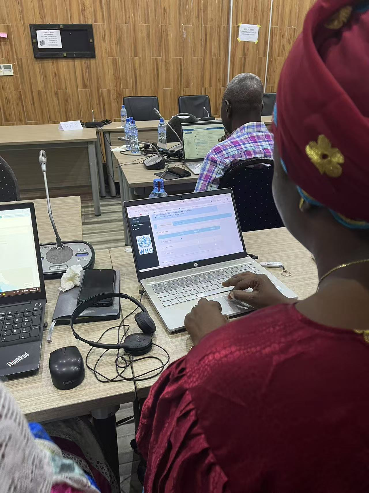

---
output:
  bookdown::html_book:
    number_sections: false
---

<!-- ## SAE4Health Featured in WHO Workshops Across Africa -->
#  SAE4Health in WHO Workshops Across Africa
The **SAE4Health** platform was a cornerstone of a series of **WHO-led workshops** across Africa, focused on strengthening country capacity to analyze subnational health data. With maternal health as a central theme, participants gained hands-on experience using the <code>sae4health</code> R Shiny app to generate localized estimates and inform data-driven decision-making.

## Kigali: The Launch of SAE4Health

The first public rollout of SAE4Health took place in <strong>Kigali, Rwanda</strong>, from <strong>June 18–20, 2024</strong>, during a multi-country workshop co-organized by *WHO*, the *Buffet Foundation*, and the *Rwandan Ministry of Health*. Participants from **10 countries** — <strong>Benin</strong>, <strong>Burkina Faso</strong>, <strong>Central African Republic</strong>, <strong>Democratic Republic of the Congo</strong>, <strong>Guinea-Bissau</strong>, <strong>Rwanda</strong>, <strong>Senegal</strong>, <strong>Sierra Leone</strong>, <strong>Tanzania</strong>, and <strong>Zambia</strong> — gathered to explore how subnational data could improve maternal health outcomes, particularly around antenatal care and unsafe abortion.

Key sessions were led by <strong>Dr. Haidong Wang</strong> and <strong>Charlton Callender</strong> from WHO, alongside <strong>Professor Jon Wakefield</strong>, who introduced the SAE modeling framework. Yunhan Wu</strong> presented the `sae4health`  app, guiding participants through its interface and functionality.

*Participants of the regional SAE4Health workshop in Kigali, Rwanda, June 2024. Source: [@WHORwanda](https://x.com/WHORwanda/status/1803155257301561593)* 

Using their own country data, participants conducted SAE analysis, produced maps of maternal health indicators (e.g., ANC 4+), and interpreted model results. For many, it was the first time generating actionable model-based estimates through an interactive, no-code interface. The workshop closed with discussions on integration of SAE outputs into country strategies and plans for continued WHO technical support.

<!-- # Scaling Impact: SAE4Health Featured in WHO Regional Workshops Across Africa

The **SAE4Health** platform played a central role in a series of World Health Organization (WHO)-led workshops across Africa, aimed at strengthening countries’ capacity to analyze subnational health data. With a focus on improving maternal health outcomes, participants gained hands-on experience using the `sae4health` R Shiny app to perform small area data analysis, generate precise localized estimates, and translate results into actionable policy insights.

## Advancing Subnational Analytics: Kigali Workshop Launches SAE4Health

The first public rollout of SAE4Health took place in Kigali, Rwanda, from June 18–20, 2024, during a multi-country technical workshop marking the app’s official debut in WHO-led capacity-building efforts. Hosted by the WHO in collaboration with the Buffet Foundation and the Rwandan Ministry of Health, the workshop brought together participants from ten countries: Benin, Burkina Faso, Central African Republic, Democratic Republic of Congo, Guinea-Bissau, Rwanda, Senegal, Sierra Leone, Tanzania, and Zambia. The event focused on leveraging subnational data to address maternal health challenges, including disparities in antenatal care coverage and the burden of unsafe abortion.

Technical sessions were led by Dr. Haidong Wang and Charlton Callender from WHO, and Professor Jon Wakefield from the University of Washington, who introduced the statistical framework behind small area estimation. Yunhan Wu presented the SAE4Health app. 

Participants engaged in hands-on exercises using data from their own countries, running the app to generate subnational estimates and visualizations of maternal health indicators such as ANC 4+ coverage. For many, it was the first time generating actionable model-based estimates through an interactive, no-code interface. These outputs supported the identification of high-need areas and informed discussions on how SAE findings could guide targeted policy and programmatic decisions. The workshop concluded with concrete plans for follow-up support and country-level implementation.

*Participants of the regional SAE4Health workshop in Kigali, Rwanda, June 2024.* -->

---

## Deepening Capacity: SAE4Health Training in Burkina Faso

From **November 6–8**, **2024**, a national SAE4Health workshop was held in **Ouagadougou**, **Burkina Faso**, organized by *WHO* and the *Ministry of Health, Burkina Faso*. The training aimed to build local capacity to use SAE for maternal health planning.

Participants received instruction from WHO experts and remote facilitators from the University of Washington, including Professor Jon Wakefield and Yunhan Wu. They learned to install and run the SAE4Health app, apply SAE models to national data, and generate subnational estimates of indicators such as ANC 4+ coverage. To support French-speaking participants, translated materials were provided for the statistical methods introduction and hands-on guidance, ensuring full engagement.

  

    
  

  

    
  

  

    
  

  

    
  

*Participants in Burkina Faso using the `sae4health` app during hands-on sessions.*

## SAE4Health at WHO Regional Workshop in Senegal

From November 26–28, 2024, the **SAE4Health** platform was featured at the *WHO Regional Capacity-Building Workshop* held in **Somone, Senegal**. The event was organized by the *WHO* and *Senegal's Ministry of Health and Social Action*, bringing together experts across Senegal to strengthen technical capacity in subnational health estimation.

The workshop focused on:

- Small area estimation using the `sae4health` R Shiny app
- Disaggregation and analysis of maternal health data  
- Supporting evidence-based decision-making and program planning

> “After two days of training with expertise from WHO Geneva, Senegal is strengthening its ability to leverage subnational health data in the area of **SRMNIA** (maternal, newborn, child, and adolescent health and nutrition). This process will help develop more targeted policies to reduce maternal mortality.” – [@OMS_SENEGAL](https://x.com/OMS_SENEGAL/status/1862450061617078704)

*Group photo from the SAE4Health capacity-building workshop – November 2024, Somone, Senegal. Source: [@OMS_SENEGAL](https://x.com/OMS_SENEGAL/status/1862450061617078704)*

