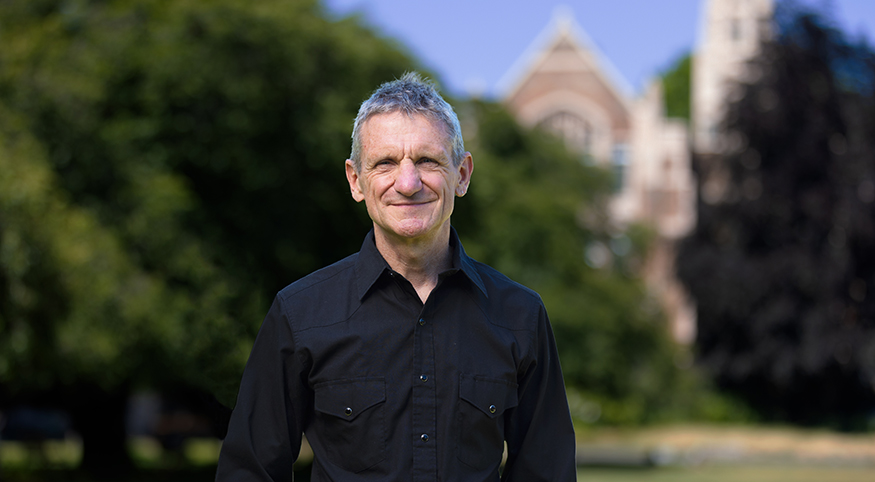
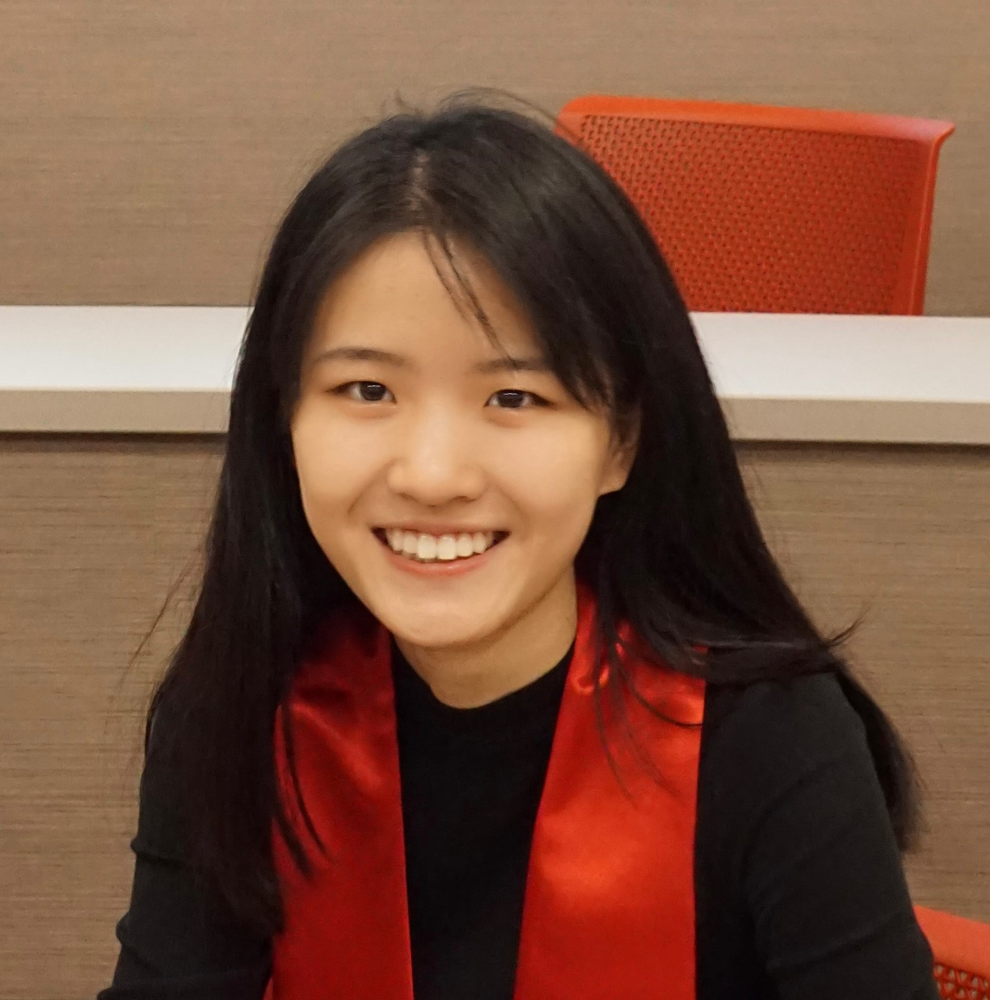
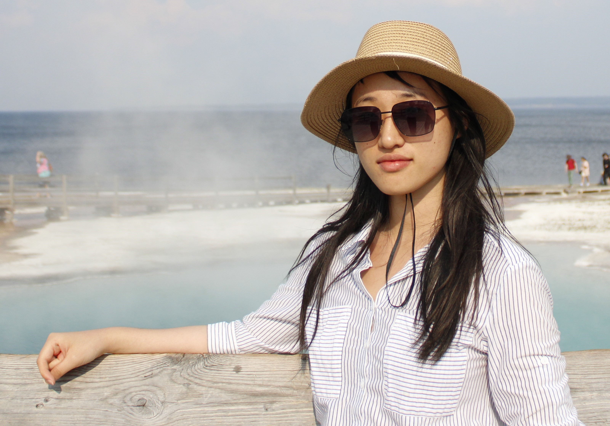
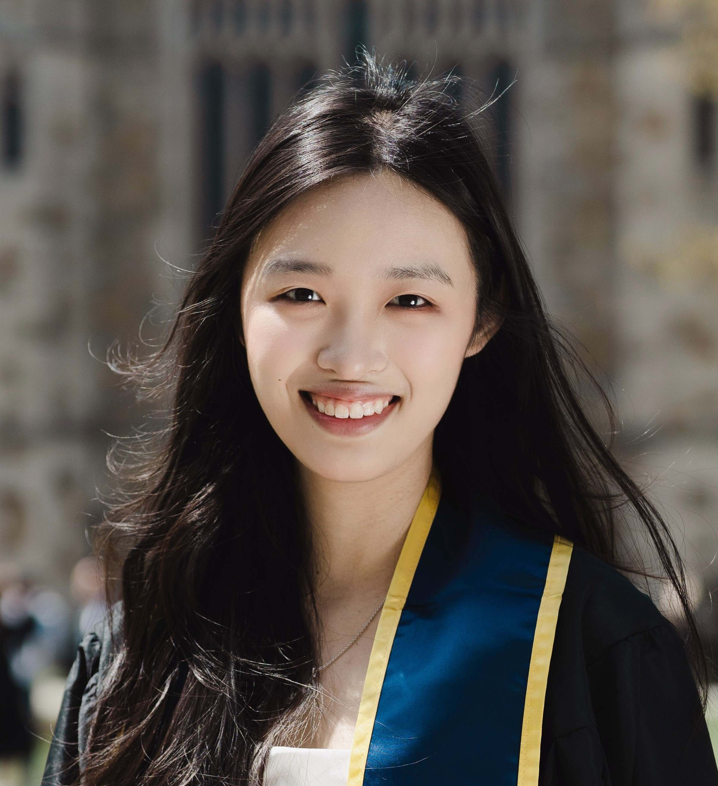
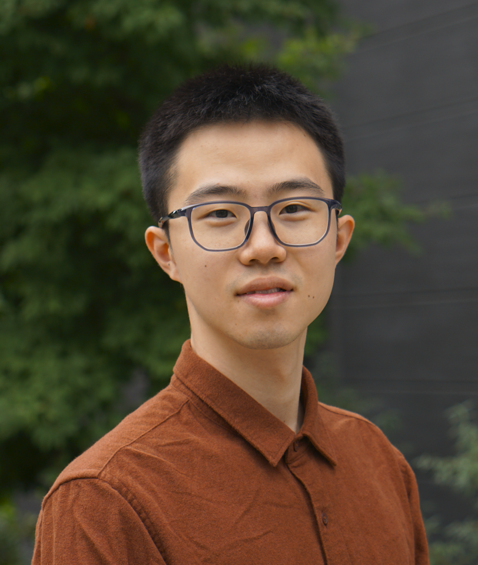

# Space Time Analysis Bayes (STAB) Lab

## Principal Investigators

- <a href="https://faculty.washington.edu/jonno/" target="_blank">Jon Wakefield</a> – Professor of Statistics and Biostatistics at Univeristy of Washington
    <!-- 

        "In my professional life, I’ve tried to develop models that can be useful. This project has been an opportunity to do something really important."
    
 -->
   <!-- { align=left }-->
    <figure markdown="span">
    {width='170' }
    </figure>

- <a href="https://zehangli.com/" target="_blank">Zehang Richard Li</a> – Assistant Professor of Statistics at University of California Santa Cruz
    <figure markdown="span">
    {width='170' }
    </figure>

## Team Members

- <a href="https://qianyu313.github.io/qd33/" target="_blank">Qianyu Dong</a> – PhD Candidate in Statistics at University of California Santa Cruz
    <figure markdown="span">
    {width='150'}
    </figure>
    

        Lead developer for the SurveyPrev R package.
    

- <a href="https://www.linkedin.com/in/yunhan-wu-956902297" target="_blank">Yunhan Wu</a> – PhD Candidate in Biostatistics at University of Washington
    <figure markdown="span">
    {width='160'}
    </figure>
    

        Lead developer for the R Shiny app and the SAE4Health website.
    

- <a href="https://www.linkedin.com/in/miaolei-bao-95683a294" target="_blank">Miaolei Bao</a> – Graduate Student in Biostatistics at University of Washington
    <figure markdown="span">
    {width='220'}
    </figure>
    

        Managed indicator coding schemes and validation.
    

- <a href="https://www.linkedin.com/in/jitong-jiang-b36392222" target="_blank">Jitong Jiang</a> – Graduate Student in Statistics at University of Washington
    <figure markdown="span">
    {width='145'}
    </figure>
    

        Managed urban/rural stratification.
    

- <a href="https://www.linkedin.com/in/zihang-yu-572793292" target="_blank">Zihang Yu</a> – Graduate Student in Biostatistics at University of Washington
    <figure markdown="span">
    {width='140'}
    </figure>
    

        Streamlined analysis pipeline for MICS surveys.
    

Other graduate students at UW: Andrea Boskovic, Ameer Dharamshi, Joshua Yang
